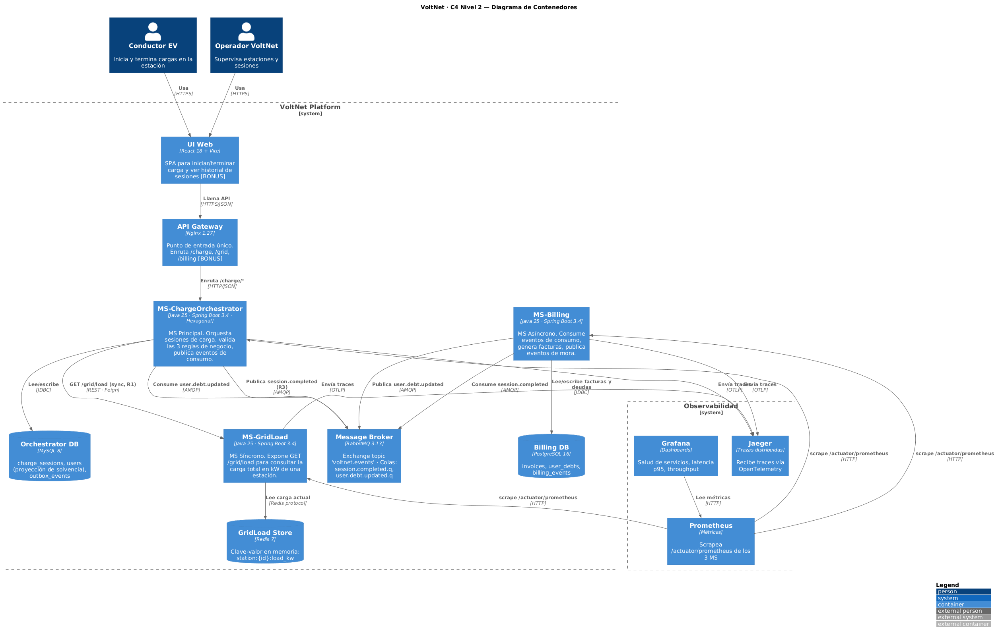
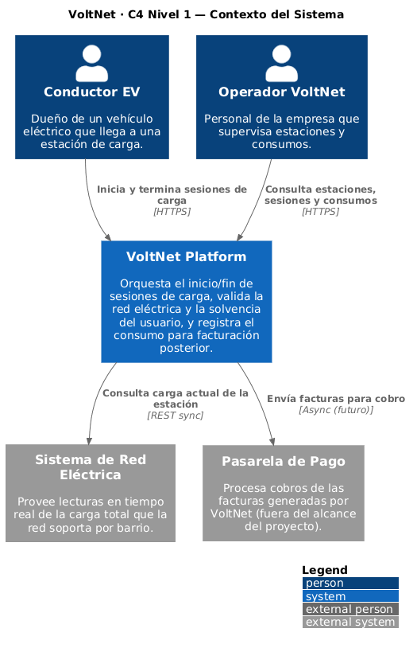

# Diagramas C4 — VoltNet

Diagramas en notación **C4 Model** usando **PlantUML** con la librería oficial [C4-PlantUML](https://github.com/plantuml-stdlib/C4-PlantUML).

## Niveles

| Nivel | Fuente PlantUML | PNG renderizado | Estado |
|---|---|---|---|
| C4 L1 — Contexto | [`c4-l1-context.puml`](c4-l1-context.puml) | [`c4-l1-context.png`](c4-l1-context.png) | ✅ Listo |
| C4 L2 — Contenedores (requerido por la rúbrica) | [`c4-l2-containers.puml`](c4-l2-containers.puml) | [`c4-l2-containers.png`](c4-l2-containers.png) | ✅ Listo |

## Vista rápida

**C4 Nivel 2 — Diagrama de Contenedores:**



**C4 Nivel 1 — Diagrama de Contexto:**



## Cómo renderizar

**Opción 1 — VS Code (recomendado durante desarrollo):**
1. Instalar extensión `jebbs.plantuml` (ya instalada).
2. Abrir el `.puml` y pulsar `Alt+D` para preview.

**Opción 2 — CLI para exportar PNG/SVG (entrega final):**
```bash
docker run --rm -v ${PWD}:/data plantuml/plantuml -tpng /data/c4-l2-containers.puml
```

**Opción 3 — Online:** copiar el contenido y pegar en https://www.plantuml.com/plantuml/uml/.

## ¿Por qué PlantUML y no Draw.io?

- **Versionable:** los `.puml` son texto plano → git diff funciona, code review funciona.
- **Reproducible:** el mismo archivo produce siempre el mismo diagrama.
- **Estándar:** C4-PlantUML es la implementación oficial recomendada por Simon Brown (creador de C4).
- **Backup en Draw.io:** para la entrega final del PDF, replicaremos el diagrama generado en draw.io para que quede visualmente más vendedor (opcional).
